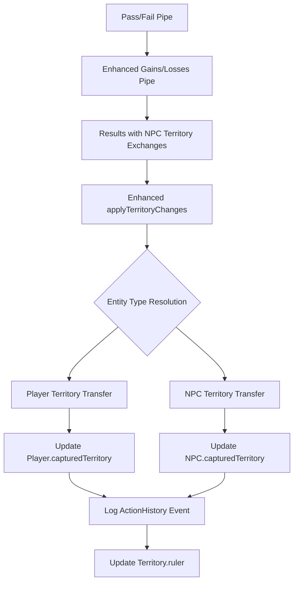

# Design Document: Judge Pipeline NPC Territory Exchange

## Overview

This design extends the existing judge pipeline to support territory exchanges between NPCs and players in both directions. The current system only handles player-to-player territory transfers through the `Results` data structure. This enhancement will enable NPCs to participate as active territorial entities, allowing them to capture territories from players and lose territories to players based on judge pipeline outcomes.

The design leverages the existing `WorldManager.applyJudgeResults` infrastructure while adding NPC-aware territory resolution and validation logic. All changes maintain backward compatibility with existing player-to-player territory exchanges.

## Architecture

### Current System Analysis

The existing judge pipeline follows this flow:
1. **Pass/Fail Pipe**: Determines if player action succeeds (`Victory?` data structure)
2. **Gains/Losses Pipe**: Determines specific outcomes (`Results` data structure)
3. **WorldManager Integration**: `applyJudgeResults` processes `Results` and updates world state
4. **Territory Processing**: `applyTerritoryChanges` handles territory ownership transfers

The current `Results` structure contains:
- `territoryGained: MutableList<String>` - Territory names gained by the acting player
- `territoryLost: MutableList<String>` - Territory names lost by the acting player

### Enhanced Architecture

The enhanced system will extend the existing judge pipeline and processing flow:



### Judge Pipeline Modifications

The existing **Gains and Losses Pipe** in `buildJudge()` will need enhancement to:

1. **Context Awareness**: Include NPC information in the pipeline context alongside player stats
2. **Enhanced Prompting**: Update system prompts to consider NPC territorial involvement
3. **Results Generation**: Generate `Results` that can specify NPC names in territory gain/loss lists

#### Enhanced Pipeline Context
The pipeline will need access to:
- Current NPC states and their territorial holdings
- Relationships between players and NPCs established in the story
- Territory ownership status for both players and NPCs

## Components and Interfaces

### Enhanced Judge Pipeline

#### Modified `buildJudge()` Function
The existing judge pipeline will be enhanced to include NPC context and awareness:

```kotlin
fun buildJudge(playerStats: Player? = null): Pipeline {
    // Enhanced context injection
    if(playerStats != null) {
        val playerJson = serialize(playerStats)
        val npcContext = serialize(WorldManager.world.npc)
        val territoryContext = serialize(WorldManager.world.mapTiles)
        
        val contextWindow = ContextWindow().apply {
            contextElements.add(playerJson)
            contextElements.add(npcContext) 
            contextElements.add(territoryContext)
        }
        ContextBank.emplace("game state", contextWindow)
    }
    // ... rest of pipeline construction
}
```

#### Enhanced Gains and Losses Pipe
The existing `gainsAndLossesPipe` will be modified with:

**Enhanced System Prompt**:
```
In accordance with the output of the previous pipe, you must now determine what the player has gained or lost as a consequence of their turn, INCLUDING any territory exchanges with NPCs. 

Consider the following when determining territorial outcomes:
- NPCs can gain territories from players through conquest, negotiation, or player failure
- Players can gain territories from NPCs through conquest, diplomacy, or NPC defeat  
- Territory names in your output can reference either player names or NPC names as new owners
- Ensure all referenced NPCs exist in the provided NPC context

When specifying territory changes:
- Use exact NPC names from the provided context
- Use exact territory names from the provided territory context
- Specify transfers clearly (e.g., "Player loses Territory X to NPC Y")
```

**Enhanced Context Injection**:
```
"game state" contains current player stats, all active NPCs with their territories, and all map territories with current ownership. Use this to determine valid territory exchanges.
```

### Enhanced WorldManager Methods

#### Modified `applyTerritoryChanges`
```kotlin
private fun applyTerritoryChanges(
    playerName: String,
    results: Results,
    turnNumber: Int,
    timestampMillis: Long
)
```

This method will be enhanced to:
1. Parse territory names from `Results.territoryGained` and `Results.territoryLost`
2. Determine if territory transfers involve NPCs or players
3. Route to appropriate transfer logic based on entity types
4. Validate all entities exist before processing transfers

#### New `applyNpcTerritoryTransfer`
```kotlin
private fun applyNpcTerritoryTransfer(
    territory: Territory,
    fromEntity: String,
    toEntity: String,
    isFromNpc: Boolean,
    isToNpc: Boolean,
    turnNumber: Int,
    timestampMillis: Long
)
```

This new method will handle:
- NPC-to-Player transfers
- Player-to-NPC transfers  
- Updating both `Territory.ruler` and entity `capturedTerritory` lists
- ActionHistory event logging

#### New `validateTerritoryTransferEntities`
```kotlin
private fun validateTerritoryTransferEntities(
    territoryName: String,
    fromEntity: String?,
    toEntity: String?
): TerritoryTransferValidation
```

This validation method will:
- Verify territory exists in `world.mapTiles`
- Verify NPCs exist in `world.npc` 
- Verify players exist in `world.activePlayers`
- Return validation results with specific error messages

### Data Models

#### Enhanced Results Processing
The existing `Results` data structure remains unchanged, but processing logic will be enhanced to interpret territory exchanges involving NPCs:

```kotlin
// Example Results that the enhanced pipeline might generate:
Results(
    resultSummary = "Player failed to defend against NPC invasion",
    territoryGained = listOf(), // Player gains nothing
    territoryLost = listOf("Fortress Valley"), // Player loses this territory
    // The system will infer from context that "Fortress Valley" goes to the attacking NPC
)

// Or for player success against NPC:
Results(
    resultSummary = "Player successfully conquered NPC stronghold", 
    territoryGained = listOf("Dark Tower"), // Player gains from NPC
    territoryLost = listOf(), // Player loses nothing
)
```

#### New Territory Exchange Resolution Logic
```kotlin
data class TerritoryExchangeContext(
    val actingPlayer: String,
    val involvedNpcs: List<String>, // NPCs mentioned in the story/action
    val territoryOwnership: Map<String, String> // territory name -> current owner
)
```

#### New `TerritoryTransferValidation`
```kotlin
data class TerritoryTransferValidation(
    val isValid: Boolean,
    val territory: Territory?,
    val fromEntity: EntityInfo?,
    val toEntity: EntityInfo?,
    val errorMessage: String = ""
)

data class EntityInfo(
    val name: String,
    val isNpc: Boolean,
    val entity: Any? // Player or Npc instance
)
```

#### Enhanced Territory Resolution Logic

The system will use a context-aware resolution process:

1. **Story Context Analysis**: Parse the `resultSummary` and action context to identify involved NPCs
2. **Territory Resolution**: Use existing `World.findTerritoryByName()` 
3. **Transfer Direction Detection**: Determine if territory moves from player→NPC or NPC→player based on:
   - Current territory ownership
   - Story context (who attacked whom, who succeeded/failed)
   - Results lists (gained vs lost from player perspective)
4. **Entity Validation**: Verify all involved entities exist before processing
5. **Transfer Execution**: Update both entity lists and territory ruler field

#### Territory Exchange Detection Algorithm
```kotlin
fun detectTerritoryExchange(
    results: Results,
    actingPlayer: String,
    storyContext: String
): List<TerritoryExchange> {
    val exchanges = mutableListOf<TerritoryExchange>()
    
    // Analyze territories lost by player
    results.territoryLost.forEach { territoryName ->
        val territory = world.findTerritoryByName(territoryName)
        val involvedNpc = extractNpcFromStoryContext(storyContext, territoryName)
        if (territory != null && involvedNpc != null) {
            exchanges.add(TerritoryExchange(
                territory = territory,
                fromEntity = actingPlayer,
                toEntity = involvedNpc,
                transferType = TransferType.PLAYER_TO_NPC
            ))
        }
    }
    
    // Analyze territories gained by player  
    results.territoryGained.forEach { territoryName ->
        val territory = world.findTerritoryByName(territoryName)
        val currentOwner = territory?.ruler
        if (territory != null && world.findNpcByName(currentOwner) != null) {
            exchanges.add(TerritoryExchange(
                territory = territory,
                fromEntity = currentOwner!!,
                toEntity = actingPlayer,
                transferType = TransferType.NPC_TO_PLAYER
            ))
        }
    }
    
    return exchanges
}
```

## Correctness Properties

*A property is a characteristic or behavior that should hold true across all valid executions of a system-essentially, a formal statement about what the system should do. Properties serve as the bridge between human-readable specifications and machine-verifiable correctness guarantees.*

Based on the prework analysis, I've identified the following testable properties that eliminate redundancy and provide comprehensive validation:

### Property 1: NPC Territory Ownership Consistency
*For any* NPC and territory, when the NPC gains or loses the territory, both the Territory.ruler field and the NPC.capturedTerritory list should be updated consistently
**Validates: Requirements 1.1, 1.2, 1.4**

### Property 2: Player-NPC Territory Transfer Completeness  
*For any* player-to-NPC territory transfer, the territory should be removed from the player's capturedTerritory list and added to the NPC's capturedTerritory list
**Validates: Requirements 2.1, 2.2, 2.3**

### Property 3: NPC-Player Territory Transfer Completeness
*For any* NPC-to-player territory transfer, the territory should be removed from the NPC's capturedTerritory list and added to the player's capturedTerritory list  
**Validates: Requirements 3.1, 3.2, 3.3**

### Property 4: Territory Exchange ActionHistory Logging
*For any* territory exchange involving NPCs, a TerritoryEventMetadata should be logged with correct previousOwner and newOwner fields
**Validates: Requirements 1.3, 2.4, 3.4, 6.1, 6.2, 6.3**

### Property 5: Entity Type Detection and Validation
*For any* Results containing entity names, the system should correctly distinguish between player names and NPC names, and validate that all referenced entities exist
**Validates: Requirements 4.2, 4.3, 4.4, 5.2**

### Property 6: Invalid Entity Handling
*For any* Results referencing non-existent NPCs or territories, the system should skip the exchange and log appropriate warnings
**Validates: Requirements 4.5, 5.1, 5.3, 5.4**

### Property 7: Global Territory Ownership Consistency
*For any* world state, the Territory.ruler field should be consistent with the corresponding entity's capturedTerritory list across all players and NPCs
**Validates: Requirements 5.5, 7.1, 7.3**

### Property 8: ActionHistory System Compatibility
*For any* ActionHistory events generated by NPC territory exchanges, the events should be processable by existing HistoryParser and ScoreManager systems
**Validates: Requirements 6.4**

<function_calls>
<invoke name="prework">
<parameter name="featureName">judge-npc-territory-exchange

## Error Handling

### Validation Failures
- **Non-existent Territory**: Log warning and skip exchange when territory name doesn't match any in `world.mapTiles`
- **Non-existent NPC**: Log warning and skip exchange when NPC name doesn't exist in `world.npc`
- **Non-existent Player**: Log warning and skip exchange when player name doesn't exist in `world.activePlayers`
- **Ownership Mismatch**: Log warning when territory's current owner doesn't match expected transfer source

### Concurrency Safety
- All territory exchanges must acquire `WorldManager.worldMutex` before modifying world state
- Updates to `Territory.ruler`, `NPC.capturedTerritory`, and `Player.capturedTerritory` must be atomic
- ActionHistory events must be recorded within the same mutex lock to ensure consistency

### Graceful Degradation
- Invalid territory exchanges are skipped without affecting valid exchanges in the same Results
- System continues processing remaining territory changes even if some fail validation
- Comprehensive logging ensures debugging information is available for failed exchanges

## Testing Strategy

### Dual Testing Approach
The system will use both unit tests and property-based tests to ensure comprehensive coverage:

**Unit Tests** will verify:
- Specific examples of player-to-NPC and NPC-to-player transfers
- Edge cases like empty territory lists and malformed entity names
- Integration with existing ActionHistory and WorldManager systems
- Error conditions and logging behavior

**Property-Based Tests** will verify:
- Universal properties across all possible territory exchanges
- Consistency invariants that must hold regardless of specific entities involved
- Comprehensive input coverage through randomized test data generation

### Property-Based Testing Configuration
- **Testing Framework**: Kotest Property Testing for Kotlin
- **Test Iterations**: Minimum 100 iterations per property test
- **Test Tagging**: Each property test tagged with format: **Feature: judge-npc-territory-exchange, Property {number}: {property_text}**

### Test Data Generation
Property tests will generate:
- Random World states with varying numbers of players, NPCs, and territories
- Random Results objects with different combinations of territory gains/losses
- Random entity names including edge cases (empty strings, special characters, case variations)
- Random territory ownership scenarios to test consistency invariants

### Integration Testing
- Verify compatibility with existing `HistoryParser.parseActionHistory()`
- Verify compatibility with existing `ScoreManager.processActionHistory()`
- Test end-to-end judge pipeline execution with NPC territory exchanges
- Validate ActionHistory event format matches existing metadata schemas
